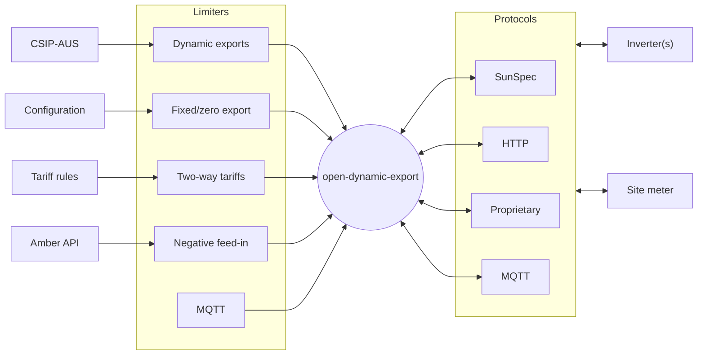
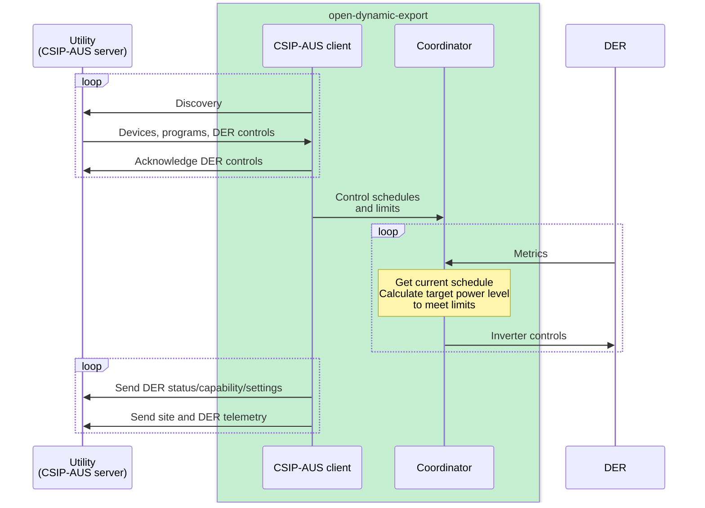

## About

This project aims to implement dynamic export control/solar curtailment of inverters using Node.js/TypeScript to satisfy
- dynamic connection requirements (CSIP-AUS/SEP2/IEEE 2030.5) of various Australian energy distributors (DNSPs)
- fixed/zero export limitations (e.g. 1.5kW export limit)
- two-way tariffs (e.g.time based) export limitation
- negative feed-in (e.g. Amber) export limitation



## Supported inverters and site meter

Inverters:

| Name    | `config.json` inverter type | Description                                                                                      | Tested models                                                                                                                                                                                                                                   |
| ------- | --------------------------- | ------------------------------------------------------------------------------------------------ | ----------------------------------------------------------------------------------------------------------------------------------------------------------------------------------------------------------------------------------------------- |
| SunSpec | `sunspec`                   | SunSpec Modbus TCP compatible inverter<br>Must support models 1, 101/102/103, 120, 121, 122, 123 | <a href="https://github.com/longzheng/open-dynamic-export/wiki/Fronius-SunSpec-Modbus-configuration">Fronius Primo</a><br><a href="https://github.com/longzheng/open-dynamic-export/wiki/Fronius-SunSpec-Modbus-configuration">Fronius Symo</a> |

Site meter:

| Name              | `config.json` meter type | Description                                                                     | Tested models                                                                |
|-------------------|--------------------|---------------------------------------------------------------------------------|---------------------------------------------------------------------------------|
| SunSpec           | `sunspec`          | SunSpec Modbus TCP compatible smart meter<br>Must support models 1, 201/202/203 | Fronius Smart Meter 1 phase<br>Fronius Smart Meter 3 phase<br>Catch Power Relay |
| Tesla Powerwall 2 | `powerwall2`       |                                                                                 | Backup Gateway 2                                                                |

> [!IMPORTANT]
> The application assumes the smart meter is configured as a feed-in or export/import meter installed at the grid connection to accurately measure the site export/import. Smart meters installed as consumption metering is not supported due to ambiguity if there are other loads or batteries that are not counted towards the site export/import.

## Configuration

The server uses a configuration JSON to configure how it works. 

### Inverters and meters

To configure the inverter and meter connections, add the following property to `config.json`

```js
{
    "inverters": [ // (array) required: list of inverters
        {
            "type": "sunspec", // (string) required: the type of inverter
            "ip": "192.168.1.6", // (string) required: the IP address of the inverter
            "port": 502, // (number) required: the Modbus TCP port of the inverter
            "unitId": 1 // (number) required: the Modbus unit ID of the inverter
        }
    ],
    "inverterControl": true, // (true/false) optional: whether the inverters should be controlled based on limits, turn off to simulate
    "meter": {
        "type": "sunspec", // (string) required: the type of meter
        "ip": "192.168.1.6", // (string) required: the IP address of the meter
        "port": 502, // (number) required: the SunSpec Modbus TCP port of the meter
        "unitId": 240 // (number) required: the SunSpec unit ID of the meter
    }
    ...
}
```

### Limiters

All limiters are restrictive, that is a combination of multiple limiters will evaluate all limiters and enforce the most prohibitive value of each control type at any one time.

Currently there are four control surfaces, mapped to the CSIP-AUS modes

| Mode            | Description                                                                                  | Overlap resolution     | Default value |
|-----------------|----------------------------------------------------------------------------------------------|------------------------|---------------|
| opModConnect    | Connection to the grid                                                                       | Prioritize disconnect  | Connect       |
| opModEnergize   | Generate or consume energy (in practice for most inverters this is the same as opModConnect) | Prioritize de-energize | Energized     |
| opModExportLimW | Maximum export limit (in watts)                                                              | Lower limit            | Unlimited     |
| opModGenLimW    | Maximum inverter generation limit (in watts)                                                 | Lower limit            | Unlimited     |

#### Fixed limit

To set fixed limits (such as for fixed export limits), add the following property to `config.json`

```js
{
    "limiters": {
        "fixed": {
            "connect": true, // (true/false) optional: whether the inverters should be connected to the grid
            "exportLimitWatts": 5000, // (number) optional: the maximum export limit in watts
            "generationLimitWatts": 10000 // (number) optional: the maximum generation limit in watts
        }
    }
    ...
}
```

#### Negative feed-in

To set a zero export limit based on negative feed-in, add the following property to `config.json`

For Amber Electric:
```js
{
    "limiters": {
        "negativeFeedIn": {
            "type": "amber", // (string) required: the source of the negative feed-in data
            "apiKey": "asdf", // (string) required: the Amber API key
            "siteId": "12345" // (string) required: the Amber site ID
        }
    }
    ...
}
```

#### Two-way tariffs

To set a zero export limit based on two-way tariffs, add the following property to `config.json`

For Ausgrid EA029 tariff:
```js
{
    "limiters": {
        "twoWayTariff": {
            "type": "ausgridEA029"
        }
    }
    ...
}
```

For SAPN RELE2W tariff:
```js
{
    "limiters": {
        "twoWayTariff": {
            "type": "sapnRELE2W"
        }
    }
    ...
}
```

#### CSIP-AUS

> [!IMPORTANT]
> This CSIP-AUS client cannot run without device certificates (and manufacturer certificates issued by the utility server which must be manually registered) and is not provided in this repository. A future version of this application will support a self-service device registration process.

To use CSIP-AUS, add following property to `config.json`

```js
{
    "limiters": {
        "sep2": {
            "host": "https://sep2-test.energyq.com.au", // (string) required: the SEP2 server host
            "dcapUri": "/api/v2/dcap" // (string) required: the device capability discovery URI
        }
    }
    ...
}
```

#### MQTT

To set limits based on a MQTT topic, add the following property to `config.json`

```js
{
    "limiters": {
        "mqtt": {
            "host": "mqtt://192.168.1.123",
            "topic": "limits"
        }
    }
    ...
}
```

The MQTT topic must contain a JSON message that meets the following schema

```js
z.object({
    opModConnect: z.boolean().optional(),
    opModEnergize: z.boolean().optional(),
    opModExpLimW: z.number().optional(),
    opModGenLimW: z.number().optional(),
});
```

## Run server

### Docker compose

1. Clone repo

1. Copy `.env.example` and rename it to `.env` and change the values to suit

1. Create a `/config` folder and copy the [`config.example.json` file from the repo](https://github.com/longzheng/open-dynamic-export/blob/main/config/config.example.json) and rename it to `config.json`. Set it with the required values.

1. Run `docker compose up -d` (or run `docker compose up -d --build`)

## CSIP-AUS client

The project implements a CSIP-AUS compatible client that interacts with the utility server (SEP2 server). The initial implementation focuses on the Energy Queensland requirements as outlined in the [SEP2 Client Handbook published by Energy Queensland](https://www.energex.com.au/__data/assets/pdf_file/0007/1072618/SEP2-Client-Handbook-13436740.pdf).



The initial plan is to implement a direct gateway client that interacts directly with the utility server and the DER (solar inverters). The downside of a direct client approach is the registration process is manual and requires generating keys and certificates for each site/NMI. If the project is successful, a future version will allow self-service registration or a cloud-hosted aggregator proxy.

## Features

- [x] Limits control
  - [x] Fixed limits
  - [x] Dynamic negative feed-in
    - [x] Amber
    - [ ] Localvolts
  - [x] Two-way tariffs
  - [x] CSIP-AUS
- [x] Inverter integration
  - [x] SunSpec Modbus TCP
- [x] Meter integration
  - [x] SunSpec Modbus TCP
  - [x] Tesla Powerwall
- [x] CSIP-AUS/SEP2/IEEE 2030.5 client
  - [x] Discovery and scheduled entity polling
  - [x] ConnectionPoint in-band registration
  - [x] DER status/capability/settings reporting
  - [x] DER control scheduling and default DER control fallback
  - [x] Site/DER "mirror usage point" "mirror meter reading" reporting
  - [x] Software-based limit ramping (`setGradW` or `rampTms`)
- [x] Metrics logging in InfluxDB

Future
- [ ] CSIP-AUS self-service certificate generation
- [ ] CSIP-AUS cloud aggregator proxy mode
- [ ] Web UI with real-time metrics and historical metrics
- [ ] Device package (plug and play solution)

## CSIP-AUS Private key and CSR

CSIP-AUS uses PKI certificates to authorise and identify clients.

As a direct client, there needs to be two certificates, one for the "manufacturer" and one for the "device". The "manufacturer" certificate needs to be signed by the utility Smart Energy Root CA (SERCA). Then the "device" certificate is signed with the "manufacturer" certificate & key.

To generate a device certificate key and certificate signing request.

```bash
npm run cert:device-request
```

For local testing, generate a valid self signed certificate using

```bash
openssl req -x509 -new -key key.pem -out cert.pem -sha256 -days 3650 -nodes -subj "/"
```

For live testing, generate a valid device certificate by signing it with the manufacturer certificate.

```bash
npm run cert:device-generate
```

To view the device certificate LFDI

```
http://localhost:3000/csipAus/id
```

The manufacturer certificate is signed manually by the utility. The certificate key and certificate signing request can be generated with

```bash
openssl ecparam -name secp256r1 -genkey -noout -out mica_key.pem
openssl req -new -key mica_key.pem -out mica_cert_req.csr -sha256 -subj "/"
```

## Motivation

My parents living in Queensland have a solar PV system and was required to move to Energex's dynamic connection to install an Tesla Powerwal battery because the total inverter capacity was >10kVA. A requirement of the dynamic connection is the use of a "complaint provider" (SEP2 client/device) to manage the solar inverters to meet dynamic export rules.

I opted for the CATCH Power Solar Relay solution since it was already installed at the site (for hot water control) and I wanted to support an Australian company. Unfortunately my experience with their product was subpar due to confusing UIs and a buggy implementation of SunSpec which does not support daisy chained Fronius inverters. I spent considerable time debugging their Modbus implementation and I tried to contact them to help improve their product but they were quite arrogant and not interested in my feedback.

So I thought I should put my efforts on making a better product that is open source since I have an interest in energy markets and was curious about the SEP2/CSIP-AUS standards.

I got in touch with Energy Queensland who was surprisingly helpful (for a government agency) and was open to the idea of an open-source client.

## Resources

- [SEP2 Client Handbook published by Energy Queensland](https://www.energex.com.au/__data/assets/pdf_file/0007/1072618/SEP2-Client-Handbook-13436740.pdf)
- [IEEE 2030.5 standard](https://standards.ieee.org/ieee/2030.5/5897/)
- [IEEE 2030.5 Data Model](https://zepben.github.io/evolve/docs/2030-5/)
- [SEP2 Common Library](https://github.com/ethanndickson/sep2_common) Rust library
- [SEP2-Tools](https://github.com/aguinane/SEP2-Tools) Python library
- [Common Smart Inverter Profile - IEEE 2030.5 Implementation Guide for Smart Inverters v2.1](https://sunspec.org/wp-content/uploads/2019/08/CSIPImplementationGuidev2.103-15-2018.pdf)
- [Common Smart Inverter Profile – Australia v1.1a](https://arena.gov.au/assets/2021/09/common-smart-inverter-profile-australia.pdf)
- [Common Smart Inverter Profile - Australia - Test Procedures v1.0](https://bsgip.com/wp-content/uploads/2023/09/CSIP-AUS-Comms-Client-Test-Procedures-v1.0-final.pdf)
- [SA Power Networks - Dynamic Exports Test Procedure v1.2](https://www.talkingpower.com.au/71619/widgets/376925/documents/239206)
