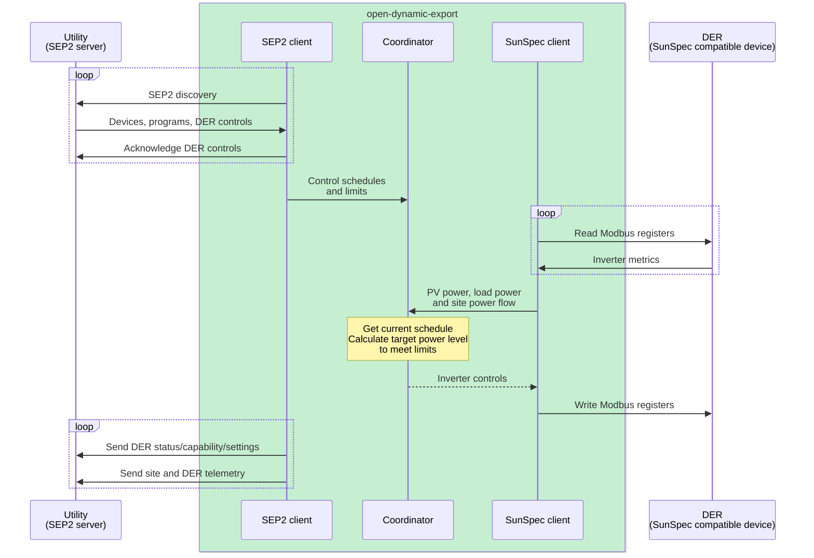

## About

This project aims to implement dynamic export control using Node.js/TypeScript implementing SEP2/IEEE 2030.5-2018/CSIP-AUS (utility connection) and SunSpec Modbus (inverter connection) to satisfy the dynamic connections requirement of various Austrailan energy markets.   

The initial implementation focuses on the Energy Queensland requirements as outlined in the [SEP2 Client Handbook published by Energy Queensland](https://www.energex.com.au/__data/assets/pdf_file/0007/1072618/SEP2-Client-Handbook-13436740.pdf).

## Requirements

- One or more SunSpec compatible solar inverter(s) (tested with Fronius Primo and Fronius Symo)
- One or more SunSpec compatible smart meter(s) (tested with Fronius Smart Meter and Catch Power Relay)

> [!IMPORTANT]
> The application assumes the smart meter is configured as a feed-in or export/import meter installed at the grid connection to accurately measure the site export/import. Smart meters installed as consumption metering is not supported due to ambiguity if there are other loads or batteries that are not counted towards the site export/import.

## Architecture



The initial plan is to implement a SEP2 direct gateway client that interacts directly with the utility server and the DER (solar inverters). This client will be hosted on-site (e.g. home server/Raspberry Pi) using a Docker container and communicate directly with DER in the same local network using Modbus TCP.

The downside of a direct client approach is the registration process is manual and requires generating keys and certificates for each site/NMI. If the project is successful, a future cloud hosted instance will use a cloud proxy gateway architecture to allow self-service registration.

## Features

- [x] SEP2/IEEE 2030.5 client
  - [x] Discovery and scheduled entity polling
  - [x] DER status/capability/settings reporting
  - [x] DER control scheduling
  - [x] Mirror usage point site/DER telemetry reporting
- [x] SunSpec Modbus client
  - [x] Model scanning
  - [x] Inverter/meters data polling
  - [X] Inverter control
- [x] Software-based `setGradW` ramping

Future
- [ ] Self-service certificate generation
- [ ] Cloud proxy mode
- [ ] Web UI with real-time metrics and historical metrics
- [ ] Device package (plug and play solution)

## Running server

> [!IMPORTANT]
> This application cannot run without certified issued by the utility server which must be manually registered and is not provided in this repository. A future version of this application will support a self-service registration process.

The Node.js application can be run both directly and via a Docker image.

#### Node.js directly

1. Clone repo
2. Install dependencies `npm install`
3. In the `./config` folder make a copy of `config.json.example` and rename it to `config.json`, modify the relevant values
4. Run `npm run start`

#### Docker

1. Create a Docker Compose file `compose.yaml` with the following content

```yaml
services:
  open-dynamic-export:
    image: longzhengau/open-dynamic-export:latest
    volumes:
      - ./config/:/app/config/
      - ./logs/:/app/logs/
    restart: 'always'
```

2. Create a `./config` folder and copy the `config.json.example` file from the repo and rename it to `config.json`

3. Run `docker-compose up -d`

## Private key and CSR

The SEP2 server uses PKI certificates to authorise and identify clients.

As a direct client, there needs to be two certificates, one for the "manufacturer" and one for the "device". The "manufacturer" certificate needs to be signed by the utility Smart Energy Root CA (SERCA). Then the "device" certificate is signed with the "manufacturer" certificate & key.

To generate a device certificate key and certificate signing request.

```bash
npm run device-cert-request
```

For local testing, generate a valid self signed certificate using

```bash
openssl req -x509 -new -key key.pem -out cert.pem -sha256 -days 3650 -nodes -subj "/"
```

For live testing, generate a valid device certificate by signing it with the manufacturer certificate.

```bash
npm run device-cert-sign
```

To view the device certificate LFDI

```bash
npm run device-cert-lfdi
```

The manufacturer certificate is signed manually by the utility. The certificate key and certificate signing request can be generated with

```bash
openssl ecparam -name secp256r1 -genkey -noout -out mica_key.pem
openssl req -new -key mica_key.pem -out mica_cert_req.csr -sha256 -subj "/"
```

## Motivation

My parents living in Queensland have a solar PV system and was required to move to Energex's dynamic connection to install an Tesla Powerwal battery because the total inverter capacity was >10kVA. A requirement of the dynamic connection is the use of a "complaint provider" (SEP2 client/device) to manage the solar inverters to meet dynamic export rules.

I opted for the CATCH Power Solar Relay solution since it was already installed at the site (for hot water control) and I wanted to support an Australian company. Unfortunately my experience with their product was subpar due to confusing UIs and a buggy implementation of SunSpec which does not support daisy chained Fronius inverters. I spent considerable time debugging their Modbus implementation and I tried to contact them to help improve their product but they were quite arrogant and not interested in my feedback.

So I thought I should put my efforts on making a better product that is open source since I have an interest in energy markets and was curious about the SEP2/CSIP-AUS standards.

I got in touch with Energy Queensland who was surprisingly helpful (for a government agency) and was open to the idea of an open-source client.

## Resources

- [SEP2 Client Handbook published by Energy Queensland](https://www.energex.com.au/__data/assets/pdf_file/0007/1072618/SEP2-Client-Handbook-13436740.pdf)
- [IEEE 2030.5 standard](https://standards.ieee.org/ieee/2030.5/5897/)
- [IEEE 2030.5 Data Model](https://zepben.github.io/evolve/docs/2030-5/)
- [SEP2 Common Library](https://github.com/ethanndickson/sep2_common) Rust library
- [SEP2-Tools](https://github.com/aguinane/SEP2-Tools) Python library
- [Common Smart Inverter Profile - IEEE 2030.5 Implementation Guide for Smart Inverters v2.1](https://sunspec.org/wp-content/uploads/2019/08/CSIPImplementationGuidev2.103-15-2018.pdf)
- [Common Smart Inverter Profile – Australia v1.1a](https://arena.gov.au/assets/2021/09/common-smart-inverter-profile-australia.pdf)
- [Common Smart Inverter Profile - Australia - Test Procedures v1.0](https://bsgip.com/wp-content/uploads/2023/09/CSIP-AUS-Comms-Client-Test-Procedures-v1.0-final.pdf)
- [SA Power Networks - Dynamic Exports Test Procedure v1.2](https://www.talkingpower.com.au/71619/widgets/376925/documents/239206)
