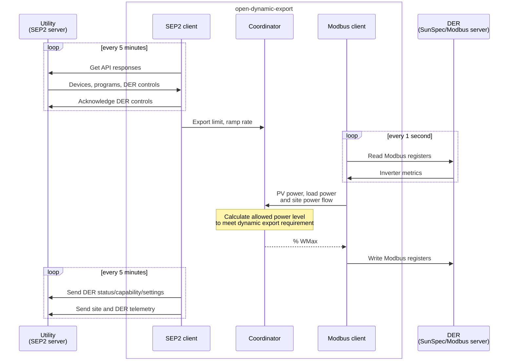

## About

This project aims to implement dynamic export control using Node.js/TypeScript implementing SEP2/IEEE 2030.5-2018/AS 5385:2023 (utility connection) and SunSpec Modbus (inverter connection) to satisfy the dynamic connections requirement of various Austrailan energy markets.   

The initial implementation focuses on the Energy Queensland requirements as outlined in the [SEP2 Client Handbook published by Energy Queensland](https://www.energex.com.au/__data/assets/pdf_file/0007/1072618/SEP2-Client-Handbook-13436740.pdf).

## Architecture



The initial plan is to implement a SEP2 direct gateway client that interacts directly with the utility server and the DER (solar inverters). This client will be hosted on-site (e.g. home server/Raspberry Pi) using a Docker container and communicate directly with DER in the same local network using Modbus TCP.

The downside of a direct client approach is the registration process is manual and requires generating keys and certificates for each site/NMI. If the project is successful, a future cloud hosted instance will use a cloud proxy gateway architecture to allow self-service registration.

## Implementation plan

1.0
- [x] Project bootstrap
- [x] Private Enterprise Number (PEN) registration
- [x] SEP2 client
  - [x] XML response parsing
  - [x] XML request generation
  - [ ] Scheduled polling and pushing
  - [ ] DER status/capability/settings reporting
  - [ ] DER control events acknowledgement
  - [ ] Telemetry reporting
- [ ] SunSpec Modbus client
  - [ ] Fronius inverter testing
- [ ] Dynamic export control logic

Future
- [ ] Cloud proxy mode
- [ ] Web UI
- [ ] Device package (plug and play solution)

## Private key and CSR

The SEP2 server uses PKI certificates to authorise and identify clients.

To generate a key and certificate signing request.

```bash
openssl ecparam -name secp256r1 -genkey -noout -out key.pem
openssl req -new -key key.pem -out cert_req.csr -sha256 -subj "/CN= /O= "
```

For testing, generate a self signed certificate using

```bash
openssl req -x509 -new -key key.pem -out cert.pem -sha256 -days 3650 -nodes -subj "/C=XX/ST=StateName/L=CityName/O=CompanyName/OU=CompanySectionName/CN=CommonNameOrHostname"
```

## Motivation

My parents living in Queensland have a solar PV system and was required to move to Energex's dynamic connection to install an Tesla Powerwal battery because the total inverter capacity was >10kVA. A requirement of the dynamic connection is the use of a "complaint provider" (SEP2 client/device) to manage the solar inverters to meet dynamic export rules.

I opted for the CATCH Power Solar Relay solution since it was already installed at the site (for hot water control) and I wanted to support an Australian company. Unfortunately my experience with their product was subpar due to confusing UIs and a buggy implementation of SunSpec which does not support daisy chained Fronius inverters. I spent considerable time debugging their Modbus implementation and I tried to contact them to help improve their product but they were quite arrogant and not interested in my feedback.

So I thought I should put my efforts on making a better product that is open source since I have an interest in energy markets and was curious about the SEP2/CSIP-AUS standards.

I got in touch with Energy Queensland who was surprisingly helpful (for a government agency) and was open to the idea of an open-source client.

## Resources

- [SEP2 Client Handbook published by Energy Queensland](https://www.energex.com.au/__data/assets/pdf_file/0007/1072618/SEP2-Client-Handbook-13436740.pdf)
- [IEEE 2030.5 Data Model](https://zepben.github.io/evolve/docs/2030-5/)
- [SEP2 Common Library](https://github.com/ethanndickson/sep2_common) Rust library
- [SEP2-Tools](https://github.com/aguinane/SEP2-Tools) Python library
- [CSIP spec](https://sunspec.org/wp-content/uploads/2019/08/CSIPImplementationGuidev2.103-15-2018.pdf)
- [CSIP-AUS spec](https://arena.gov.au/assets/2021/09/common-smart-inverter-profile-australia.pdf)