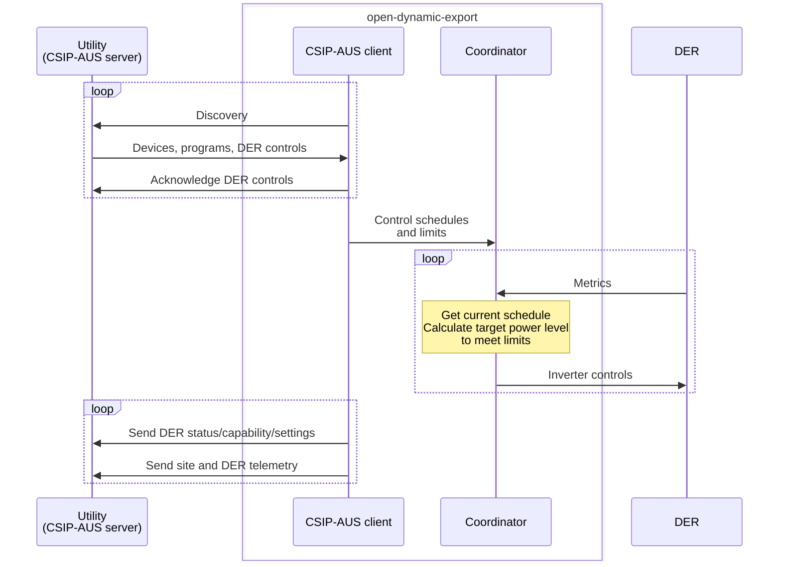

# CSIP-AUS

[CSIP-AUS (Common Smart Inverter Profile Australia)](https://arena.gov.au/assets/2021/09/common-smart-inverter-profile-australia.pdf) is an electricity network communications standard. 

It is based on the [IEEE 2030.5](https://standards.ieee.org/ieee/2030.5/5897/) standard and is used by Australian electricity utilities/DNSPs (Distributed Network Service Providers) to dyamically control site import and exports for dynamic/flexible connections. It is also referenced as SEP2 (Smart Energy Profile 2).

The project implements a CSIP-AUS compatible gateway client that interacts with the utility server (CSIP-AUS/SEP2 server). The initial implementation focuses on the [SA Power Networks requirements](https://www.talkingpower.com.au/71619/widgets/376925/documents/239205) and [Energy Queensland requirements](https://www.energex.com.au/__data/assets/pdf_file/0007/1072618/SEP2-Client-Handbook-13436740.pdf).

## Testing and certification

The CSIP-AUS client was tested and certified by the [South Australia Power Network (SAPN)](https://www.talkingpower.com.au/techproviders) for single and multi-inverter configurations in October 2024.

Unfortunately due to different regional requirements, some DNSPs also require CSIP-AUS clients to be listed by the Clean Energy Council. Even though Clean Energy Council accepts SAPN testing certificates, the listing fee is $1,000 per device OEM which is cost prohibitive for open source projects.

| State | Utility                       | Certification              | Tested             | Approved use                                                                                                                                                                                      |
|-------|-------------------------------|----------------------------|--------------------|---------------------------------------------------------------------------------------------------------------------------------------------------------------------------------------------------|
| SA    | South Australia Power Network | Accepts SAPN certification | :white_check_mark: | :x: Requires CEC listing                                                                                                                                                                          |
| QLD   | Energex Ergon Energy       | Accepts SAPN certification | :white_check_mark: | :white_check_mark: Does not require CEC listing,  [separate complaint providers list](https://www.energex.com.au/__data/assets/pdf_file/0005/1097744/Dynamic-Connections-Compliant-Providers.pdf) |

## Device certificate

CSIP-AUS uses PKI certificates to authenticate the connection/site/device to the utility's server.

As a direct gateway client, the client requires a device certificate and manufacturer certificate to authenticate with the utility server. The device certificate is signed by the manufacturer certificate, and the manufacturer certificate is signed by the utility's root certificate.

### Energex/Ergon Energy

The client has been listed as a compliant provider for Energex/Ergon Energy and the project is soon to be issued a manufacturer certificate for production use.

A device certificate for Energex/Ergon Energy (Queensland) can be obtained by emailing long.zheng@gmail.com