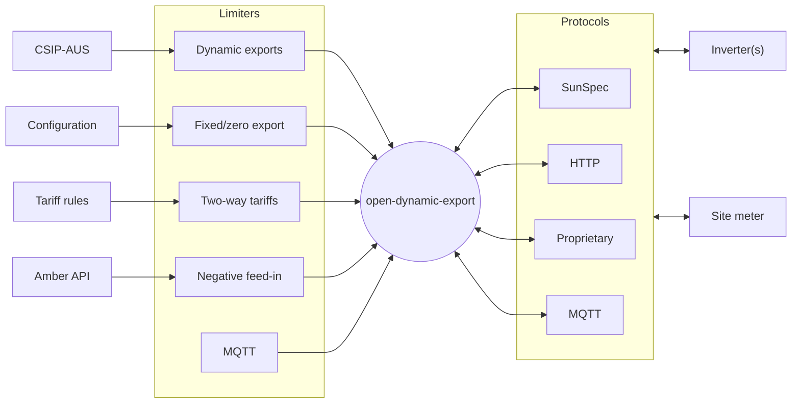

# Getting started

Open-dynamic-export is a Node/TypeScript project implementing dynamic export control/solar curtailment of inverters. It aims to solve these use cases:
- dynamic connection requirements (CSIP-AUS/SEP2/IEEE 2030.5) of various Australian energy distributors (DNSPs)
- fixed/zero export limitations (e.g. 1.5kW export limit)
- two-way tariffs (e.g.time based) export limitation
- negative feed-in (e.g. Amber) export limitation

## Architecture



### Limiters
The system uses one or more "limiters" to set the operating envelope of the site. All limiters are restrictive, that is a combination of multiple limiters will evaluate all limiters and enforce the most prohibitive value of each control type at any one time. [Learn more about configuring limiters](./configuration/limiters).

Currently there are four control modes, mapped to the CSIP-AUS modes

| Mode            | Description                                                                                  | Overlap resolution     | Default value |
|-----------------|----------------------------------------------------------------------------------------------|------------------------|---------------|
| opModConnect    | Connection to the grid                                                                       | Prioritize disconnect  | Connect       |
| opModEnergize   | Generate or consume energy (in practice for most inverters this is the same as opModConnect) | Prioritize de-energize | Energized     |
| opModExportLimW | Maximum export limit (in watts)                                                              | Lower limit            | Unlimited     |
| opModGenLimW    | Maximum inverter generation limit (in watts)                                                 | Lower limit            | Unlimited     |

### Inverters
The system supports one or more inverters to measure the site's generation metrics and control the power output. [Learn more about configuring inverters](./configuration/inverters).

### Site meter
The system supports one site meter to measure the site's load and export metrics. [Learn more about configuring site meter](./configuration/meter).

## Install

### Docker compose

1. Clone Git repo

2. Copy `.env.example` and rename it to `.env` and change the values to suit your environment

```yaml
TZ=Australia/Melbourne # Your system timezone
SERVER_PORT=3000 # API server port
CONFIG_DIR=./config # Directory to store configuration files
SEP2_CERT_FILE=sapn_cert.pem # CSIP-AUS/SEP2 certificate file (in the config directory)
SEP2_KEY_FILE=sapn_key.pem # CSIP-AUS/SEP2 key file (in the config directory)
SEP2_PEN=62223 # CSIP-AUS/SEP2 Private Enterprise Number
INFLUXDB_USERNAME=admin # InfluxDB username
INFLUXDB_PASSWORD=password # InfluxDB password
INFLUXDB_ADMIN_TOKEN=super-secret-auth-token # InfluxDB admin token
INFLUXDB_ORG=open-dynamic-export # InfluxDB organisation
INFLUXDB_BUCKET=data # InfluxDB bucket
INFLUXDB_PORT=8086 # InfluxDB port
LOGLEVEL=debug # Log level (valid values: trace, debug)
```

3. In the `/config` folder, make a copy of the `config.example.json` file and rename it to `config.json`. Update it with the relevant values, see the "Configuration" section for more details.

4. Run `docker compose up -d` (optionally run `docker compose up -d --build` to build the image from the source code)