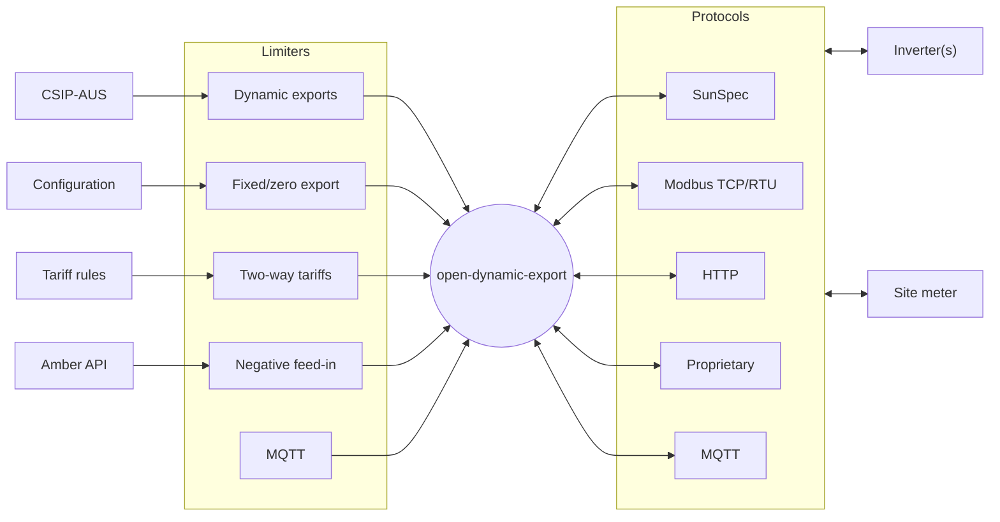

# Getting started

## Introduction

*Open Dynamic Export* is a Node/TypeScript project implementing dynamic export control/solar curtailment of inverters. It aims to solve these use cases:
- dynamic connection requirements (CSIP-AUS/SEP2/IEEE 2030.5) of various Australian energy distributors (DNSPs)
- fixed/zero export limitations (e.g. 1.5kW export limit)
- two-way tariffs (e.g.time based) export limitation
- negative feed-in (e.g. Amber) export limitation

## Architecture



### Limiters
The system uses one or more "limiters" to set the operating envelope of the site. All limiters are restrictive, that is a combination of multiple limiters will evaluate all limiters and enforce the most prohibitive value of each control type at any one time. [Learn more about configuring limiters](/configuration/limiters).

### Inverters
The system supports one or more inverters to measure the site's generation metrics and control the power output. [Learn more about configuring inverters](/configuration/inverters).

### Site meter
The system supports one site meter to measure the site's load and export metrics. [Learn more about configuring site meter](/configuration/meter).

## Install

1. Clone Git repo

2. Copy `.env.example` and rename it to `.env` and change the values to suit your environment

```yaml
TZ=Australia/Melbourne # System timezone
SERVER_PORT=3000 # API server port
CONFIG_DIR=./config # Directory to store configuration files
SEP2_CERT_FILE=sapn_cert.pem # CSIP-AUS/SEP2 certificate file path (in the config directory)
SEP2_KEY_FILE=sapn_key.pem # CSIP-AUS/SEP2 key file path (in the config directory)
SEP2_PEN=62223 # CSIP-AUS/SEP2 Provider Private Enterprise Number (does not need to be changed)
# INFLUXDB_USERNAME=admin # Optional InfluxDB username, enable to log data to InfluxDB
# INFLUXDB_PASSWORD=password # Optional InfluxDB password, enable to log data to InfluxDB
# INFLUXDB_ADMIN_TOKEN=super-secret-auth-token # Optional InfluxDB admin token, enable to log data to InfluxDB
# INFLUXDB_ORG=open-dynamic-export # Optional InfluxDB organisation, enable to log data to InfluxDB
# INFLUXDB_BUCKET=data # Optional InfluxDB bucket, enable to log data to InfluxDB
# INFLUXDB_PORT=8086 # Optional InfluxDB port, enable to log data to InfluxDB
# LOGLEVEL=debug # Optional log level (valid values: trace, debug. default: debug)
```

3. In the `/config` folder, make a copy of the `config.example.json` file and rename it to `config.json`. Update it with the relevant values, see the "Configuration" section for more details.

Use Node or Docker to run the project.

### Node
You can run the Node project directly with the Node.js runtime.

1. Install dependencies with `npm install`

2. Build the project with `npm run build`

3. Run the project with `npm start`

### Docker compose

1. Run `docker compose up -d` to use from the Docker Hub image (optionally run `docker compose up -d --build` to build the image from the source code)

2. Optionally uncomment the `influxdb` service in the `docker-compose.yml` file to enable logging to InfluxDB

### Web UI
You can view the dashboard at `http://localhost:3000` (or the server port you specified in the `.env` file).


