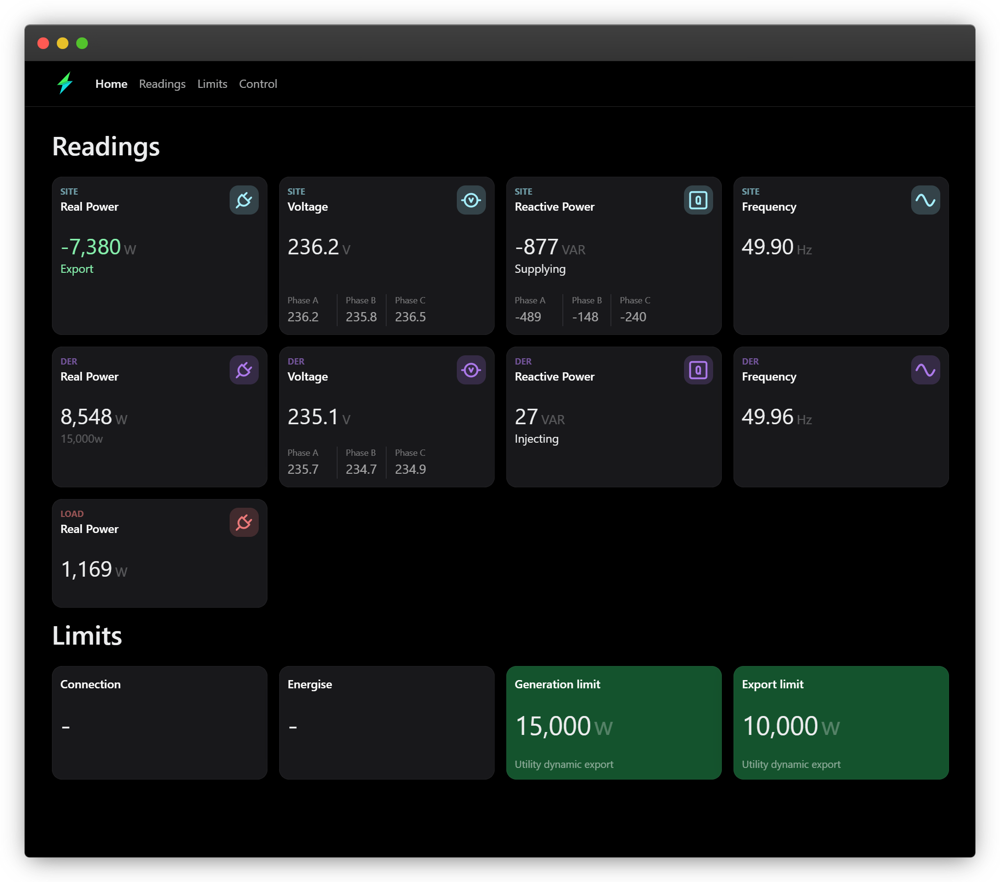

---
# https://vitepress.dev/reference/default-theme-home-page
layout: home

hero:
  name: "Open Dynamic Export"
  tagline: Open source solar inverter export control/curtailment
  actions:
    - theme: brand
      text: User guide
      link: /guide
    - theme: alt
      text: Source code
      link: https://github.com/longzheng/open-dynamic-export
  image:
    src: /logo.svg
    alt: Open Dynamic Export

features:
  - title: Dynamic/flexible export control
    details: Certified CSIP-AUS/SEP2 client for Australian DNSP dynamic connections 
  - title: Fixed/zero export
    details: Load-following export control
  - title: Two-way tarrifs/negative feed-in
    details: Curtail export based on fixed schedules or dynamic pricing
---

## Hardware package and dashboard

If you're a home owner or electrician interested in a plug and play hardware package with an integrated dashboard user interface, contact long.zheng@gmail.com

## OEM/commercial integrations

For cloud integrations with OEM inverter devices, more advanced load management or commercial use cases, contact long.zheng@gmail.com

